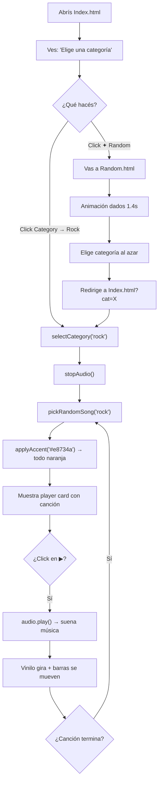

# 📖 Documentación Completa — Ejercicio 8: Generador de Música

> [!NOTE]
> Esta documentación está pensada para alguien que sabe lo básico de HTML/CSS pero **no sabe JavaScript**. Cada concepto se explica desde cero.

---

## 📁 Estructura del Proyecto

```
Ejercicio8/
├── Index.html      ← Página principal (reproductor)
├── Random.html     ← Página de sorteo aleatorio
├── style.css       ← Estilos de Index.html
├── styler.css      ← Estilos de Random.html
└── songs/          ← Archivos MP3
    ├── Bubble Pop Electric.mp3
    ├── ElhijodeHernandez.mp3
    ├── IDOL.mp3
    └── The Chainsmokers - Closer.mp3
```

---

# 🟧 PARTE 1: HTML de Index.html

## 1.1 El `<head>` — Configuración de la página

```html
<meta charset="UTF-8" />
```
Le dice al navegador qué **codificación de caracteres** usar. UTF-8 soporta acentos (á, é), la ñ, emojis, japonés, etc. Sin esto, podrías ver caracteres raros en vez de "á" o "ñ".

```html
<meta name="viewport" content="width=device-width, initial-scale=1.0"/>
```
Hace que la página se vea bien en **celulares**. Sin esto, el celular mostraría la página como si fuera una pantalla de escritorio (todo diminuto). `width=device-width` = "usá el ancho real del dispositivo". `initial-scale=1.0` = "no hagas zoom al cargar".

```html
<link rel="preconnect" href="https://fonts.googleapis.com">
```
`preconnect` le dice al navegador: "vamos a necesitar conectarnos a este servidor pronto, empezá a conectarte **ya**". Es una **optimización de velocidad** — la fuente carga más rápido.

```html
<link href="https://fonts.googleapis.com/css2?family=Bebas+Neue&family=Space+Mono:wght@400;700&display=swap" rel="stylesheet">
```
Descarga **dos fuentes tipográficas** de Google Fonts:
- **Bebas Neue** → la fuente grande de los títulos (tipo cartel de película)
- **Space Mono** → la fuente monoespaciada del resto (todos los caracteres tienen el mismo ancho, como en una terminal)

`wght@400;700` = descargá peso **400** (normal) y **700** (negrita).

---

## 1.2 Los Blobs — Decoración de fondo

```html
<div class="blob blob-1"></div>
<div class="blob blob-2"></div>
```

Son `div` **completamente vacíos**. No tienen texto ni nada adentro. Su único propósito es visual: en CSS se convierten en **círculos enormes y borrosos** que dan un efecto de luz de colores suave en el fondo. Es pura decoración.

---

## 1.3 La Navbar — Barra de navegación

```html
<nav>
  <div class="nav-title">Music Generator</div>
  <div class="nav-right">
    <!-- dropdown y random van acá -->
  </div>
</nav>
```

`<nav>` es una etiqueta **semántica** de HTML5. Funciona igual que un `<div>`, pero le dice al navegador y a Google: "esto es una barra de navegación". Tiene dos hijos: el título a la izquierda y los controles a la derecha.

### El Dropdown (menú desplegable)

```html
<div class="dropdown" id="catDropdown">
  <button class="nav-btn" id="catBtn">
    Category<span class="arrow">▾</span>
  </button>
  <div class="dropdown-menu">
    <button class="drop-item" data-cat="rock"> Rock</button>
    <button class="drop-item" data-cat="jpop"> J-Pop</button>
    <button class="drop-item" data-cat="electronic"> Electronic</button>
    <button class="drop-item" data-cat="pop"> Pop</button>
  </div>
</div>
```

**`id="catDropdown"`** — Un `id` es un **nombre único** que le das a un elemento. Sirve para que JavaScript lo encuentre después con `getElementById`. Ningún otro elemento puede tener el mismo `id`.

**`data-cat="rock"`** — Esto es un **atributo personalizado** (custom data attribute). HTML te deja inventar tus propios atributos si empiezan con `data-`. Acá lo usamos para guardar el nombre de la categoría en cada botón. JavaScript después lo lee con `item.dataset.cat`.

**`<span class="arrow">▾</span>`** — Un `<span>` es como un `<div>` pero **en línea** (no ocupa toda la fila). Acá envuelve la flechita ▾ para poder rotarla con CSS cuando el menú se abre.

---

## 1.4 El Player Card — Tarjeta del reproductor

```html
<div id="player-card">
  <p class="category-label">Playing: <span id="cat-display">—</span></p>
  <div class="vinyl" id="vinyl"></div>
  <div>
    <p class="song-name" id="song-name">—</p>
    <p class="song-artist" id="song-artist">—</p>
  </div>
  <div class="waveform" id="waveform">
    <div class="bar"></div>
    <div class="bar"></div>
    <div class="bar"></div>
    <div class="bar"></div>
    <div class="bar"></div>
  </div>
  <button id="play-btn"><span id="play-label">▶ REPRODUCIR</span></button>
</div>
```

- **`#player-card`** empieza **oculto** (`display: none` en CSS). JavaScript lo muestra cuando elegís una categoría.
- **`.vinyl`** es un `div` vacío que CSS convierte en un disco de vinilo.
- **`.waveform`** tiene 5 `div.bar` vacíos que CSS anima como barras de ecualizador.
- Los textos `—` son **placeholders** que JavaScript reemplaza con el nombre real de la canción.

```html
<audio id="audio-player"></audio>
```
El elemento `<audio>` es la forma nativa de HTML5 de reproducir sonido. Está **oculto** (CSS: `display: none`). JavaScript le pone la canción con `audio.src = "ruta.mp3"` y la reproduce con `audio.play()`.

---

# 🟦 PARTE 2: CSS de style.css

## 2.1 Reset Universal

```css
*, *::before, *::after { box-sizing: border-box; margin: 0; padding: 0; }
```

| Parte | Significado |
|-------|-------------|
| `*` | Selecciona **TODOS** los elementos de la página |
| `*::before, *::after` | Selecciona también los pseudo-elementos |
| `box-sizing: border-box` | El `width` incluye padding y border (no se suma aparte) |
| `margin: 0; padding: 0` | Elimina los espacios por defecto que el navegador pone |

> [!TIP]
> Sin `box-sizing: border-box`, si ponés `width: 100px` y `padding: 20px`, el elemento mediría 140px (100 + 20 + 20). Con `border-box`, mide 100px total. Mucho más intuitivo.

## 2.2 Variables CSS (`:root`)

```css
:root {
  --bg:     #121212;
  --accent: #1db954;
  /* ... etc */
}
```

`:root` selecciona el elemento raíz del documento (`<html>`). Las **variables CSS** se definen con `--nombre` y se usan con `var(--nombre)`.

**¿Para qué sirven?** → Si usás el color `#1db954` en 20 lugares y querés cambiarlo, sin variables tendrías que cambiar 20 líneas. Con variables, cambiás **una sola línea** y se actualiza en todos lados.

**Lo más importante:** JavaScript puede **cambiar estas variables en tiempo real**. Así funciona el cambio de colores cuando elegís una categoría.

## 2.3 Navbar — `position: fixed`

```css
nav {
  position: fixed;
  top: 0; left: 0; right: 0;
}
```

`position: fixed` saca al elemento del flujo normal y lo **fija en la pantalla**. Aunque hagas scroll, la navbar se queda arriba. `top: 0; left: 0; right: 0` = pegada al borde superior, de izquierda a derecha.

## 2.4 El Dropdown en CSS

```css
.dropdown-menu {
  position: absolute;
  display: none;
}
.dropdown.open .dropdown-menu { display: flex; }
```

El menú empieza **invisible** (`display: none`). Cuando JavaScript agrega la clase `open` al padre `.dropdown`, el selector `.dropdown.open .dropdown-menu` se activa y lo muestra.

**`position: absolute`** — posiciona el menú respecto a su padre más cercano que tenga `position: relative` (que es `.dropdown`). `top: calc(100% + 8px)` lo pone justo debajo del botón + 8px de separación.

## 2.5 La Flecha del Dropdown

```css
.nav-btn .arrow { transition: transform .25s; }
.dropdown.open .arrow { transform: rotate(180deg); }
```

Cuando el dropdown se abre, la flechita ▾ **rota 180°** (queda apuntando arriba ▴). `transition: transform .25s` hace que la rotación sea **suave** en 0.25 segundos, no instantánea.

## 2.6 Los Blobs en CSS

```css
.blob {
  position: fixed;
  border-radius: 50%;       /* Lo hace círculo */
  filter: blur(100px);      /* Lo difumina mucho */
  opacity: 0.07;            /* Casi invisible (7% visible) */
  pointer-events: none;     /* Los clicks lo atraviesan */
}
```

`pointer-events: none` es importante — sin esto, el blob invisible bloquearía los clicks en los elementos que están debajo.

## 2.7 El Vinilo

```css
.vinyl {
  background: conic-gradient(
    #1e1e1e 0deg, #2a2a2a 40deg, #1e1e1e 80deg, ...
  );
}
```

`conic-gradient` crea un degradado **circular** (como un reloj). Alterna entre dos grises para simular los surcos del disco.

```css
.vinyl::after {
  content: '';
  background: var(--accent);
}
```

`::after` es un **pseudo-elemento**: crea un elemento extra **sin necesidad de HTML**. Acá crea el **punto central** del vinilo con el color de acento. `content: ''` es obligatorio para que aparezca.

```css
.vinyl.spinning { animation: spin 3s linear infinite; }
@keyframes spin { to { transform: rotate(360deg); } }
```

Cuando JavaScript agrega la clase `.spinning`, el vinilo empieza a girar 360° cada 3 segundos, infinitamente.

## 2.8 Las Barras del Waveform

```css
.waveform .bar {
  animation: wave 1s ease-in-out infinite;
}
.waveform .bar:nth-child(2) { animation-delay: .1s; }
.waveform .bar:nth-child(3) { animation-delay: .2s; }

@keyframes wave {
  0%,100% { height: 6px; }
  50%     { height: 28px; }
}
```

Cada barra sube y baja de 6px a 28px. `:nth-child(2)` selecciona la **segunda** barra y le pone un retraso de 0.1s, la tercera 0.2s, etc. Esto crea el efecto de **onda** — no se mueven todas al mismo tiempo.

## 2.9 Transiciones vs Animaciones

| `transition` | `animation` |
|-------------|-------------|
| Se activa cuando **algo cambia** (hover, clase agregada) | Se ejecuta **sola**, puede ser infinita |
| Solo va de A a B | Puede tener múltiples pasos (keyframes) |
| Ejemplo: hover en botón | Ejemplo: vinilo girando |

---

# 🟨 PARTE 3: JavaScript — Desde Cero

## 3.1 ¿Qué es JavaScript?

HTML = la **estructura** (qué elementos hay).
CSS = la **apariencia** (cómo se ven).
JavaScript = el **comportamiento** (qué pasa cuando hacés algo).

Sin JavaScript, la página sería estática — no podrías hacer click para reproducir música, ni cambiar colores, ni abrir menús.

## 3.2 `const`, `let` — Declarar variables

```javascript
const SONGS = { ... };    // const = CONSTANTE, no se puede cambiar después
let currentCat = null;    // let = VARIABLE, se puede cambiar después
```

| Palabra | ¿Se puede cambiar? | ¿Cuándo usar? |
|---------|-------------------|---------------|
| `const` | ❌ No | Cuando el valor nunca va a cambiar |
| `let` | ✅ Sí | Cuando el valor va a cambiar |

`null` significa **"nada"** o **"vacío"**. Al inicio no hay categoría seleccionada, por eso `currentCat = null`.

## 3.3 Tipos de datos usados en este proyecto

### Strings (texto)
```javascript
'rock'          // entre comillas simples
"IDOL"          // entre comillas dobles (es lo mismo)
`index.html?cat=${picked}`  // template literal (entre backticks `)
```
Los **template literals** (con `` ` ``) te dejan meter variables adentro del texto con `${variable}`. Es como concatenar pero más fácil:
```javascript
// Sin template literal:
"index.html?cat=" + picked
// Con template literal (lo mismo, más limpio):
`index.html?cat=${picked}`
```

### Numbers (números)
```javascript
0.07    // decimal
1400    // entero (milisegundos)
```

### Booleans (verdadero/falso)
```javascript
let isPlaying = false;   // false = no está sonando
isPlaying = true;        // true = está sonando
```

### Arrays (listas)
```javascript
const cats = ['rock', 'jpop', 'electronic', 'pop'];
//            [0]      [1]      [2]            [3]    ← índices
```
Un array es una **lista ordenada**. Cada elemento tiene un **índice** que empieza en **0** (no en 1). `cats[0]` = `'rock'`, `cats[1]` = `'jpop'`, etc.

### Objetos
```javascript
const cancion = {
  title: "IDOL",
  artist: "YOASOBI",
  src: "songs/IDOL.mp3"
};
```
Un objeto es como un **diccionario**: tiene **claves** (title, artist, src) y **valores**. Se accede con punto: `cancion.title` → `"IDOL"`.

### Objetos con Arrays adentro (SONGS)
```javascript
const SONGS = {
  rock: [
    { title: "El hijo de Hernández", artist: "Cuarteto de Nos", src: "..." }
  ],
  jpop: [
    { title: "IDOL", artist: "YOASOBI", src: "..." }
  ]
};
```
`SONGS` es un **objeto** donde cada valor es un **array de objetos**. Para acceder: `SONGS.rock[0].title` → `"El hijo de Hernández"`.

## 3.4 `document.getElementById()` — Encontrar elementos

```javascript
const playBtn = document.getElementById('play-btn');
```

`document` = el documento HTML completo.
`.getElementById('play-btn')` = "buscame el elemento que tenga `id="play-btn"`".

Esto devuelve una **referencia** al elemento. Ahora `playBtn` **es** ese botón — podés leer su texto, cambiarle clases, agregarle eventos, etc.

## 3.5 `addEventListener()` — Escuchar eventos

```javascript
playBtn.addEventListener('click', () => {
  // este código se ejecuta cuando hacés click en el botón
});
```

Le dice al navegador: "cuando alguien haga **click** en `playBtn`, ejecutá esta función".

**`() => { ... }`** es una **arrow function** (función flecha). Es una forma corta de escribir una función:
```javascript
// Forma larga:
function() { ... }
// Forma corta (arrow function) — es lo mismo:
() => { ... }
```

**¿Qué es una función?** Un bloque de código con un nombre que podés **reutilizar**. En vez de copiar y pegar las mismas 5 líneas, las ponés en una función y la llamás cuando la necesites.

## 3.6 `classList` — Agregar y quitar clases CSS

```javascript
dropdown.classList.toggle('open');    // Si tiene 'open' la quita, si no la agrega
dropdown.classList.add('visible');    // Agrega la clase 'visible'
dropdown.classList.remove('open');    // Quita la clase 'open'
```

Esto es el **puente entre JavaScript y CSS**. CSS tiene reglas como `.dropdown.open .dropdown-menu { display: flex; }`. JavaScript agrega/quita la clase y CSS reacciona.

## 3.7 `.textContent` — Cambiar texto

```javascript
songName.textContent = "IDOL";
```
Reemplaza el texto del elemento. Si antes decía `—`, ahora dice `IDOL`.

## 3.8 `stopPropagation()` — Detener propagación de eventos

```javascript
catBtn.addEventListener('click', (e) => {
  e.stopPropagation();
  dropdown.classList.toggle('open');
});
document.addEventListener('click', () => dropdown.classList.remove('open'));
```

Cuando hacés click en un botón, el evento **sube** por todos los padres hasta `document` (esto se llama **propagación** o **bubbling**). Sin `stopPropagation()`:

1. Click en `catBtn` → abre el dropdown ✅
2. El click sube al `document` → cierra el dropdown ❌ (inmediatamente)

Con `stopPropagation()` el click **se detiene** en el botón y no llega al `document`.

## 3.9 `querySelectorAll()` y `forEach()`

```javascript
document.querySelectorAll('.drop-item').forEach(item => {
  item.addEventListener('click', () => {
    selectCategory(item.dataset.cat);
  });
});
```

**Paso a paso:**

1. `querySelectorAll('.drop-item')` → busca **TODOS** los elementos con clase `drop-item` (devuelve una lista de 4 botones)
2. `.forEach(item => { ... })` → "para **cada uno** de esos elementos, ejecutá este código". `item` es el elemento actual en cada vuelta del ciclo
3. `item.dataset.cat` → lee el atributo `data-cat` de ese botón. Si el botón tiene `data-cat="rock"`, entonces `item.dataset.cat` = `"rock"`

## 3.10 Funciones del proyecto

### `selectCategory(cat)`
```javascript
function selectCategory(cat) {
  currentCat = cat;                           // Guarda qué categoría elegiste
  stopAudio();                                // Para la música si había
  pickRandomSong(cat);                        // Elige una canción de esa categoría
  applyAccent(ACCENT[cat]);                   // Cambia los colores
  catDisplay.textContent = LABEL[cat] || cat; // Muestra el nombre
  idleMsg.classList.add('hidden');             // Oculta "Elige una categoría"
  playerCard.classList.add('visible');         // Muestra la tarjeta
}
```

**`ACCENT[cat]`** — Accede al objeto `ACCENT` usando la variable `cat` como clave. Si `cat = 'rock'`, entonces `ACCENT['rock']` = `'#e8734a'`.

**`LABEL[cat] || cat`** — El `||` es "o". Significa: "usá `LABEL[cat]`, pero si no existe, usá `cat` directamente". Es un **valor por defecto**.

### `pickRandomSong(cat)`
```javascript
function pickRandomSong(cat) {
  const pool = SONGS[cat] || getAllSongs();
  currentSong = pool[Math.floor(Math.random() * pool.length)];
  songName.textContent   = currentSong.title;
  songArtist.textContent = currentSong.artist;
  audio.src = currentSong.src;
}
```

**Cómo elige un elemento aleatorio:**

| Paso | Código | Si `pool` tiene 4 canciones |
|------|--------|---------------------------|
| 1 | `Math.random()` | Genera número entre 0 y 0.999... (ej: 0.73) |
| 2 | `* pool.length` | Multiplica: 0.73 × 4 = 2.92 |
| 3 | `Math.floor()` | Redondea hacia abajo: 2 |
| 4 | `pool[2]` | Toma la canción en índice 2 (la tercera) |

**`audio.src = currentSong.src`** — Le dice al elemento `<audio>` qué archivo MP3 cargar.

### `applyAccent(color)`
```javascript
function applyAccent(color) {
  document.documentElement.style.setProperty('--accent', color);
}
```

`document.documentElement` = el elemento `<html>`.
`.style.setProperty('--accent', color)` = cambia la variable CSS `--accent` al nuevo color.

Como muchos elementos usan `var(--accent)`, **todo cambia de color al instante**: el título, el botón, el vinilo, las barras, los blobs.

### `playAudio()` / `pauseAudio()` / `stopAudio()`

```javascript
function playAudio() {
  audio.play().catch(() => {});     // Reproduce (.catch ignora errores)
  isPlaying = true;
  playLabel.textContent = '⏸ PAUSAR';
  vinyl.classList.add('spinning');   // El vinilo empieza a girar
  waveform.classList.add('active');  // Las barras empiezan a moverse
}
```

**`.catch(() => {})`** — `audio.play()` devuelve una **Promesa** (un valor futuro). Si falla (por ejemplo, el navegador bloquea autoplay), `.catch` atrapa el error y lo ignora. Sin esto, verías un error rojo en la consola.

### URL Parameters (líneas 198-199)
```javascript
const params = new URLSearchParams(location.search);
if (params.get('cat')) selectCategory(params.get('cat'));
```

`location.search` = lo que viene después del `?` en la URL. Si la URL es `index.html?cat=rock`, entonces `location.search` = `"?cat=rock"`.

`URLSearchParams` es una herramienta que **parsea** (descompone) eso. `params.get('cat')` = `"rock"`.

Esto permite que `Random.html` redirija a `Index.html?cat=rock` y el reproductor **automáticamente** seleccione esa categoría al cargar.

---

# 🟪 PARTE 4: Random.html y styler.css

## Random.html — El script

```javascript
const cats = ['rock', 'jpop', 'random', 'electronic', 'pop'];

setTimeout(() => {
  const picked = cats[Math.floor(Math.random() * cats.length)];
  window.location.href = `index.html?cat=${picked}`;
}, 1400);
```

**`setTimeout(función, milisegundos)`** — Espera X milisegundos y luego ejecuta la función. 1400ms = 1.4 segundos. Es el tiempo que dura la animación de los dados.

**`window.location.href = "..."`** — Cambia la URL del navegador, redirigiendo a otra página.

## styler.css — Animación pulse

```css
@keyframes pulse {
  0%, 100% { opacity: 1; }
  50%      { opacity: 0.65; }
}
```
La palabra "RANDOM" pulsa: empieza visible (1), baja a 0.65 al medio, y vuelve a 1. Infinitamente.

---

# 🔄 Flujo Completo



---

# 📋 Glosario Rápido

| Término | Significado |
|---------|-------------|
| `const` | Variable que no cambia |
| `let` | Variable que sí cambia |
| `null` | "Nada", vacío |
| `=>` | Arrow function (función corta) |
| `classList` | Las clases CSS de un elemento |
| `addEventListener` | "Cuando pase X, hacé Y" |
| `getElementById` | Buscar un elemento por su id |
| `textContent` | El texto de un elemento |
| `Math.random()` | Número aleatorio entre 0 y 1 |
| `Math.floor()` | Redondear para abajo |
| `setTimeout` | Esperar X ms y ejecutar |
| `template literal` | String con `` ` `` que permite `${variables}` |
| `dataset` | Acceder a atributos `data-*` desde JS |
| `::after` | Pseudo-elemento CSS (elemento extra sin HTML) |
| `:root` | El elemento `<html>`, donde van las variables CSS |
| `var(--nombre)` | Usar una variable CSS |
